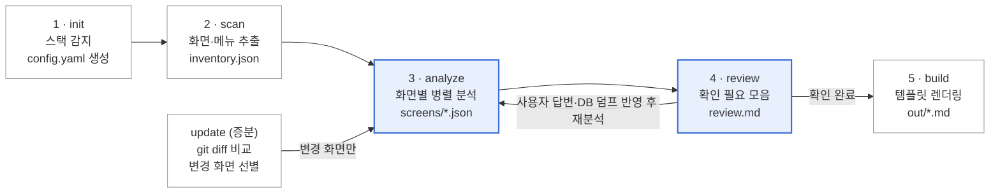

# tgx-docent 기획서

> 소스 코드를 분석해 사용자 매뉴얼과 화면 목록 초안을 만드는 크로스 에이전트 플러그인
> 기준일: 2026-10-07

## 개요

프로젝트 소스를 분석해 **최종 사용자용 매뉴얼과 화면 목록의 초안**을 만드는 크로스 에이전트 플러그인입니다. 이름은 `docent`(레포 `tgx-docent`, 명령어 `/docent`)이며, 목표는 수익이 아니라 "실제로 설치해서 쓰는 공개 플러그인"입니다.

**해결하는 문제**

- SI/SM 현장에서 사용자 매뉴얼·운영자 매뉴얼·화면 목록은 필수 산출물이지만, 개발이 끝난 뒤 수작업으로 작성되고 유지보수 중엔 거의 갱신되지 않습니다.
- 기존 AI 문서 도구는 README·API 문서 같은 개발자용 문서에 머물러, "이 화면에서 무엇을 입력하고 어떤 버튼을 누르면 무슨 일이 일어나는가"를 쓰지 못합니다.

**대상 사용자**

- 국내 SI/SM 개발자, 산출물 작성 담당자
- 매뉴얼이 없는 레거시 시스템을 인수한 유지보수 담당자
- 사이드 프로젝트에 사용 가이드를 붙이고 싶은 개인 개발자

**비목표**

- 개발자용 기술 문서(README, API 레퍼런스) 생성
- 사람 검토 없이 바로 납품 가능한 완성본
- 영상 튜토리얼, 별도 SaaS 호스팅, 수익화

## 포지셔닝과 차별점

비어 있는 자리는 "소스 기반 + 최종 사용자용 + 한국 SI 산출물 양식"의 교집합입니다.

| 범주 | 대표 도구 | 입력 | 결과물 | 빈 곳 |
| --- | --- | --- | --- | --- |
| 소스 기반 개발자 문서 | DocuWriter.ai, AutoCodeDocs, DocDog | 소스 코드 | README, API 문서, 아키텍처 | 최종 사용자 관점 없음 |
| 화면 녹화형 가이드 | Scribe, Tango | 사용자 조작 캡처 | 단계별 사용법 | 사람이 화면마다 직접 시연해야 함, 전체 화면 커버 불가 |
| 개인 실험 | Classmethod의 tsumiki 확장 | 소스 코드 | 조작 매뉴얼 초안 | 비공개, 일본어·자사 환경 한정 |
| **docent** | — | 소스 코드 (+ 선택적 화면 검증) | 화면 목록, 사용자·운영자 매뉴얼 초안 | — |

**차별점 세 가지**

1. 전체 화면을 빠짐없이 훑는 **인벤토리 우선** 방식 — 녹화형 도구가 못 하는 커버리지
2. **근거 표기와 확인 필요 마킹** — 모든 서술이 소스 위치를 가지거나, 모르는 건 모른다고 표시
3. **한국 SI 산출물 양식과 레거시 스택 지원** — ASP.NET WebForms, JSP 같은 글로벌 도구가 신경 쓰지 않는 영역

## MVP 범위

v0.1은 **Next.js App Router와 ASP.NET WebForms 두 스택**, **화면 목록과 사용자 매뉴얼 두 산출물**만 다룹니다. 파일 기반 라우팅의 현대 스택과 aspx·코드비하인드의 레거시 스택을 동시에 지원해야 스택 어댑터 추상화가 처음부터 제대로 잡힙니다.

| 버전 | 지원 스택 | 산출물 | 기타 |
| --- | --- | --- | --- |
| v0.1 (MVP) | Next.js App Router, ASP.NET WebForms | 화면 목록, 사용자 매뉴얼 (Markdown) | 증분 갱신(git diff 기준) |
| v0.2 | Spring MVC (JSP·Thymeleaf), React Router SPA | 운영자·관리자 매뉴얼, 메뉴 구조도(Mermaid) | 사용자 템플릿 교체, docx 내보내기 |
| v0.3 | 커뮤니티 어댑터 기여 구조 | 화면 정의서 | 브라우저 화면 검증·스크린샷 삽입 |

**v0.1에서 제외**

- 스크린샷 자동 캡처와 실제 화면 대조
- 운영자 매뉴얼(권한·코드 관리·배치 등 시스템 운영 영역)
- docx/hwp 출력 — Markdown만 생성하고, 변환은 사용자가 pandoc 등으로 처리
- 다국어 매뉴얼 (매뉴얼 본문은 한국어 기본, 설정으로 영어 선택)

## 실행 흐름

수집과 렌더링은 스크립트가, 화면 해석과 확인 필요 정리만 에이전트가 맡는 5단계 파이프라인입니다. 유지보수 중에는 증분 갱신으로 바뀐 화면만 다시 분석합니다.



> 파란 박스 = 에이전트(LLM) 해석, 흰 박스 = 스크립트(같은 입력이면 같은 결과)

| 명령 | 하는 일 | 주체 |
| --- | --- | --- |
| `/docent-init` | 스택 감지, `.docent/config.yaml` 생성 | 스크립트 |
| `/docent-scan` | 화면·메뉴 추출 → `inventory.json` | 스크립트 |
| `/docent-analyze [화면ID \| all]` | 화면별 서브에이전트 병렬 분석 → `screens/*.json`, `review.md` | 에이전트 |
| `/docent-build [list \| user]` | 템플릿 렌더링 → `out/*.md` | 스크립트 |
| `/docent-update` | git diff 기준 변경 화면만 재분석 후 재렌더링 | 스크립트 + 에이전트 |
| `/docent` | 위 단계를 한 번에 실행 (첫 실행용) | 전체 |

## 플러그인/레포 구조

핵심 원칙은 **결정적인 작업은 스크립트, 해석은 LLM**입니다. 파일 탐색·라우트 추출·렌더링은 Node 스크립트가 같은 입력에 같은 결과를 내고, 화면 목적·업무 흐름 서술만 에이전트가 맡습니다. 이렇게 나눠야 에이전트가 바뀌어도 결과가 크게 흔들리지 않고, 테스트가 가능합니다.

```
tgx-docent/
├─ .claude-plugin/
│  ├─ plugin.json
│  └─ marketplace.json
├─ skills/docent/
│  ├─ SKILL.md                  # 진입점: 전체 흐름과 단계별 규칙
│  ├─ references/
│  │  ├─ schema.md              # 중간 산출물 스키마
│  │  ├─ writing-style.md       # 매뉴얼 문체 규칙 (사용자 관점, 존댓말, 용어 통일)
│  │  └─ stacks/
│  │     ├─ nextjs-app-router.md
│  │     └─ aspnet-webforms.md
│  ├─ templates/
│  │  ├─ screen-list.md.hbs
│  │  └─ user-manual.md.hbs
│  └─ scripts/
│     ├─ detect-stack.mjs       # 스택 감지
│     ├─ scan.mjs               # 어댑터 호출 → inventory.json
│     ├─ adapters/nextjs.mjs
│     ├─ adapters/webforms.mjs
│     ├─ diff.mjs               # git diff → 재분석 대상 화면
│     └─ render.mjs             # screens/*.json + 템플릿 → Markdown
├─ commands/                    # /docent-init, /docent-scan, /docent-build 등
├─ agents/
│  └─ screen-analyzer.md        # 화면 1개 분석 전담 서브에이전트
├─ fixtures/                    # 샘플 프로젝트 + 기대 산출물(골든 파일)
│  ├─ nextjs-sample/
│  └─ webforms-sample/
├─ docs/
│  └─ PLAN.md                   # 이 문서
├─ AGENTS.md                    # Codex 등 다른 에이전트용 진입 안내
├─ CLAUDE.md                    # @AGENTS.md import
└─ README.md                    # 한국어 우선, 영어 병기
```

**크로스 에이전트 배포**

- Claude Code: 플러그인 마켓플레이스로 `/plugin marketplace add`
- Codex 및 SKILL.md를 읽는 에이전트: `skills/docent/`을 그대로 복사해 사용
- 스크립트는 Node 표준 라이브러리 위주로 작성하고, 외부 의존성은 템플릿 엔진 정도로 최소화

## 스택별 분석 규칙

각 스택 어댑터는 아래 8개 항목을 같은 스키마로 뽑아냅니다. 어댑터가 확정할 수 없는 항목은 `unknowns`에 남기고, LLM이 추측으로 채우지 않습니다.

| 추출 항목 | Next.js App Router | ASP.NET WebForms | Spring MVC (v0.2) |
| --- | --- | --- | --- |
| 화면 단위 | `app/**/page.tsx` (route group·동적 세그먼트 포함) | `*.aspx` 파일 | `@Controller` 매핑 + 뷰 템플릿 |
| 메뉴 구조 | `layout.tsx`의 nav 컴포넌트, 메뉴 설정 파일 | `Web.sitemap`, 마스터페이지 메뉴, DB 메뉴 테이블 | 공통 레이아웃, DB 메뉴 테이블 |
| 입력 항목 | form 필드, shadcn `FormField`, zod 스키마 | `asp:TextBox`·`DropDownList`·`GridView` 컬럼 | form 필드, DTO |
| 버튼 동작 | `onClick`, 서버 액션, `form action` | `OnClick` 핸들러(`.aspx.cs`) | 폼 action, JS 함수 |
| 처리 로직 | 서버 액션, route handler, fetch 대상 API | 코드비하인드 → 비즈 클래스 → SP·쿼리 | Service → Mapper XML |
| 권한 | `middleware.ts`, 세션·role 체크 | `Page_Load` 권한 체크, `web.config` authorization | Spring Security 설정, `@PreAuthorize` |
| 검증 규칙 | zod, `required` 속성 | `RequiredFieldValidator` 등 Validator 컨트롤 | `@Valid`, Bean Validation |
| 안내 메시지 | toast·alert 문자열 | `alert` 스크립트, `ClientScript` 등록 | `messages.properties` |

**DB 의존 항목 처리**

레거시 시스템은 메뉴·권한·코드값이 DB에 있는 경우가 많습니다. 어댑터가 메뉴 테이블 조회 쿼리를 발견하면 `unknowns`에 기록하고, 사용자가 메뉴 테이블 덤프(CSV)를 `.docent/inputs/`에 넣으면 그걸로 메뉴 경로와 권한을 채웁니다.

## 중간 산출물 스키마와 출력 구조

매뉴얼은 소스에서 바로 쓰지 않고, **화면별 JSON을 먼저 만든 뒤 템플릿으로 렌더링**합니다. JSON이 단일 진실 원천이라 양식을 바꿔도 재분석이 필요 없고, 골든 파일 테스트도 JSON 단위로 합니다.

**작업 디렉터리 (`.docent/`, 대상 프로젝트 루트에 생성)**

```
.docent/
├─ config.yaml          # 스택, 대상 경로, 제외 경로, 언어, 템플릿 경로
├─ inputs/              # 선택: 메뉴·권한 테이블 덤프 등 사용자 제공 자료
├─ inventory.json       # 화면 목록 (스크립트 생성)
├─ screens/
│  └─ ORD1010.json      # 화면별 분석 결과 (에이전트 생성)
├─ review.md            # 확인 필요 항목 모음
└─ out/
   ├─ 화면목록.md
   └─ 사용자매뉴얼.md
```

**화면 JSON 예시**

```json
{
  "id": "ORD1010",
  "title": "주문 등록",
  "route": "/order/ORD1010.aspx",
  "menuPath": ["주문관리", "주문", "주문 등록"],
  "purpose": "거래처별 신규 주문을 등록하고 저장한다",
  "roles": [
    { "value": "영업담당", "evidence": "ORD1010.aspx.cs:38", "confidence": "high" }
  ],
  "fields": [
    { "label": "거래처", "type": "select", "required": true, "evidence": "ORD1010.aspx:112" },
    { "label": "납기일", "type": "date", "required": true, "evidence": "ORD1010.aspx:131" }
  ],
  "actions": [
    {
      "label": "저장",
      "effect": "입력값 검증 후 주문을 저장하고 목록을 다시 조회한다",
      "evidence": "ORD1010.aspx.cs:btnSave_Click",
      "confidence": "medium"
    }
  ],
  "messages": [
    { "text": "저장되었습니다.", "when": "저장 성공", "evidence": "ORD1010.aspx.cs:204" }
  ],
  "unknowns": ["저장 버튼 노출 조건이 DB 권한 테이블에 의존함"],
  "sourceHash": "a1b2c3d"
}
```

`sourceHash`는 화면 관련 파일들의 해시로, 증분 갱신 시 변경된 화면만 재분석하는 기준입니다.

## 신뢰성 설계

이 플러그인의 생명은 **"틀린 걸 그럴듯하게 쓰지 않는 것"**입니다. 한 번 틀린 매뉴얼을 받은 사용자는 다시 쓰지 않습니다.

**규칙**

1. 모든 서술 항목은 `evidence`(파일:라인 또는 파일:메서드)를 가집니다. 근거가 없으면 쓰지 않습니다.
2. 해석이 들어간 항목은 `confidence`를 high·medium·low로 표기합니다. low는 본문에 `[확인 필요]`로 표시하고 `review.md`에 모읍니다.
3. 소스에 없는 기능, 화면에 없는 버튼, 추정된 업무 규칙은 쓰지 않습니다. `screen-analyzer` 프롬프트에 금지 사례를 명시합니다.
4. 출력본에는 근거를 HTML 주석(`<!-- ORD1010.aspx.cs:38 -->`)으로 남겨, 검토자가 원문을 바로 찾아갈 수 있게 합니다. 납품용 출력 시 옵션으로 제거합니다.

**보안**

- 분석은 사용자의 로컬 에이전트 안에서만 일어나고, 플러그인 자체는 외부 전송을 하지 않습니다.
- `.env`, `web.config`의 `connectionStrings`, `appsettings*.json`의 비밀값은 스캔 단계에서 마스킹합니다.
- 사내 소스에 적용할 때는 사용 중인 에이전트(모델 API)로 소스가 전송된다는 점을 README에 명시합니다.

**화면 검증 (v0.3)**

브라우저 자동화로 라우트에 접속해 실제 라벨·버튼과 JSON을 대조하고, 불일치는 `review.md`에 추가합니다. 스크린샷은 같은 단계에서 캡처해 매뉴얼에 삽입합니다.

## 마일스톤과 작업 순서

v0.1은 **픽스처와 스키마를 먼저 고정하고, 어댑터 → 분석 → 렌더링 순**으로 진행합니다. 기대 산출물을 먼저 손으로 써둬야 "좋은 매뉴얼"의 기준이 생기고, 이후 모든 단계를 그 기준으로 테스트할 수 있습니다.

**v0.1 체크리스트**

- [ ] 레포 생성, `AGENTS.md`·`CLAUDE.md`·플러그인 매니페스트 세팅
- [ ] 픽스처 작성: Next.js 샘플(화면 5~8개), WebForms 샘플(화면 5~8개) — 로그인, 목록, 등록, 상세, 권한 분기 화면 포함
- [ ] 픽스처별 기대 산출물 수작업 작성 (`inventory.json`, `screens/*.json`, `사용자매뉴얼.md`)
- [ ] `schema.md` 확정 및 JSON Schema 파일로 검증 스크립트 작성
- [ ] `detect-stack.mjs` — package.json의 next, `*.csproj`·`*.aspx` 존재로 판별
- [ ] `adapters/nextjs.mjs` — page.tsx 수집, 라우트·메뉴 추출 → inventory
- [ ] `adapters/webforms.mjs` — aspx 수집, 컨트롤·이벤트 핸들러 매핑 → inventory
- [ ] `screen-analyzer` 에이전트 프롬프트 + `writing-style.md` 작성
- [ ] 화면 병렬 분석 흐름(SKILL.md) 작성, `review.md` 생성 로직
- [ ] `render.mjs` + 템플릿 2종 (화면목록, 사용자매뉴얼)
- [ ] `diff.mjs` 증분 갱신
- [ ] 픽스처 골든 테스트 통과
- [ ] 실전 적용: 개인 프로젝트 1개 + 레거시 화면 몇 개로 체감 검증
- [ ] README(한/영), 데모 GIF, 마켓플레이스 등록, v0.1.0 릴리스

**이후**

- v0.2: Spring MVC·React Router 어댑터, 운영자 매뉴얼, 템플릿 교체, docx 내보내기
- v0.3: 브라우저 화면 검증, 스크린샷, 화면 정의서, 어댑터 기여 가이드

## 검증 계획과 성공 기준

v0.1 릴리스 조건은 **픽스처 골든 테스트 통과 + 실전 적용에서 "직접 쓰는 것보다 빠르다"는 체감**입니다. 아래 수치는 제안 기준이며 픽스처 작성 후 조정합니다.

| 기준 | 측정 방법 | 목표 (제안) |
| --- | --- | --- |
| 화면 누락 | 픽스처 기대 inventory 대비 | 누락 0건 |
| 입력 항목 정확도 | 라벨·타입·필수 여부를 골든 JSON과 비교 | 전 항목 일치 |
| 근거 없는 서술 | evidence 없는 서술 항목 수 | 0건 |
| 확인 필요 처리 | DB 의존·권한 분기 화면에서 `[확인 필요]` 표시 여부 | 해당 화면 전부 표시 |
| 첫 실행 경험 | 설정 파일 수정 없이 init → build까지 | 명령 3개 이내로 결과 생성 |
| 실사용 효과 | 같은 화면 3~5개를 수작업 작성 vs 초안 수정 시간 기록 | 초안 수정이 확실히 빠름 |

**회귀 방지**

- 픽스처 골든 테스트를 CI(GitHub Actions)에서 스크립트 단계만 자동 실행
- LLM 단계는 결과가 매번 다르므로 스키마 검증 + 근거 존재 여부만 자동 검사하고, 서술 품질은 릴리스 전 수동 리뷰

## 미정 사항

- [x] **이름**: `docent` 확정 — 레포 `tgx-docent`, 명령어 `/docent`
- [ ] **레포 위치**: 현재 계정 vs 변경 예정 계정명. 마켓플레이스 등록 후 이전하면 설치 경로가 바뀌므로 먼저 결정
- [ ] **test-guard와의 순서**: 병행 vs test-guard v0.1 이후 착수
- [ ] **사내 소스 실전 적용 가능 여부**: 회사 보안 정책상 외부 모델로 소스 전송이 허용되는지 확인. 불가하면 실전 검증은 개인 프로젝트·공개 레거시 샘플로 대체
- [ ] **첫 산출물 양식**: 범용 양식으로 갈지, 공공 SI 표준 산출물 목차에 맞출지

## 참고 자료

- [Generate the first draft of an operation manual from source code — Classmethod](https://dev.classmethod.jp/en/articles/generate-manual-from-source-design/)
- [Best AI code documentation tools — DocuWriter.ai](https://www.docuwriter.ai/best-ai-code-documentation-tools)
- [DocDog — PyPI](https://pypi.org/project/docdog/0.0.2/)
